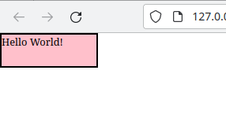

# <a href="https://www.youtube.com/watch?v=nSst4-WbEZk" target="_blank">THE BOX MODEL IN CSS</a>

#### Table of Contents

- [Box Model](#box-model)
- [Div Blocks](#div-blocks)
- [Width Height](#width-height)
- [Padding](#padding)
- [Border](#border)
- [Margin](#margin)
- [CSS Preset for Margin and Padding](#css-preset-margin-padding)
- [Box Sizing](#box-sizing)
  - [Content box](#content-box)
  - [Border box](#border-box)

## Box-Model

The box model consists of margin, border, padding and content.

<!---->


## Div-Blocks

- Div elemnts are block length elements and contain the entire width of the view port

<!---->


- The size of the div block consists of the **border**, **padding** and the **content** inside the div
- Only the margin is space outside of the div

### Width-Height

- **The height and  width is defined only for the content and not the div**

```
  .box{
    font-size: 2rem;
    background-color: pink;
    /* BOX Model*/
    width: 300px;
    height: 100px;
  }
```
<!---->


### Padding

- We can add padding for the inner content inside
- Shorthand property for padding - `padding: 32px 64px 100px 10px;` The values are assigned from the top clockwise rotation.
- 1 value will pad all four sides
- 2 values will assign the first value to top-bottom and second value to left-right
- 3 values will assign the first value to top, second value to left-right and third value to bottom.

```
  .box{
    font-size: 2rem;
    background-color: pink;
    /* BOX Model*/
    width: 300px;
    height: 100px;
    padding: 32px 64px 100px 10px;
  }
```

<!---->


### Border

- border is the boundry which encapsulates the content and the padding inside it.
- `border: thickness type color;`
- `border: 5px solid black;`  

```
  .box{
    font-size: 2rem;
    background-color: pink;
    /* BOX Model*/
    width: 300px;
    height: 100px;
    padding: 32px 64px 100px 10px;
    border: 5px solid black;
  }
```

<!---->


- There are 10 different border styles to use from

<!---->


### Margin

- Margin is the spacing outside the border 
- Shorthand property for margin - `margin: 20px`
- the values are same as padding values in clockwise direction


```
  .box{
    font-size: 2rem;
    background-color: pink;
    /* BOX Model*/
    width: 300px;
    height: 100px;
    padding: 32px 64px 100px 10px;
    border: 5px solid black;
    margin: 20px 40px 100px 500px;
  }
```
<!---->


<!--![div-element-margin]-->


### Css-Preset-Margin-Padding

- By default in CSS a margin of 8px is assigned by the user agent stylesheet if you do not specifiy any margin or a margin of 0px.
- To fix this we can add a CSS preset on top of the page for both margin and padding

```
  *{
    margin: 0;
    padding: 0;
  }
```

<!---->


### Box-Sizing

1. **content-box** - widht-height define only the **content**.
2. **border-box** - width-height define **border, padding** and **content**.

#### content-box

- By default all boxes are set to content-box.
- This defines the width-height size for content inside the div.

```
  box{
      font-size: 2rem;
      background-color: pink;
      /* BOX Model*/
      width: 300px;
      height: 100px;
      box-sizing: content-box;
  }
```

<!---->


#### border-box

- The width-height is defined for the whole div when border-box is enabled.

```
  box{
      font-size: 2rem;
      background-color: pink;
      /* BOX Model*/
      width: 300px;
      height: 100px;
      box-sizing: border-box;
  }
```

<!---->


we can calculate this by       
width = 258+16+16+5+5 = 300px     
height = 58+16+16+5+5 = 100px    

- The proper way of adding border box to all the elements is not adding it to the CSS preset, you can achieve it this way

```
  *,
  *::before,
  *::after{
    box-sizing: border-box;
  }
```
