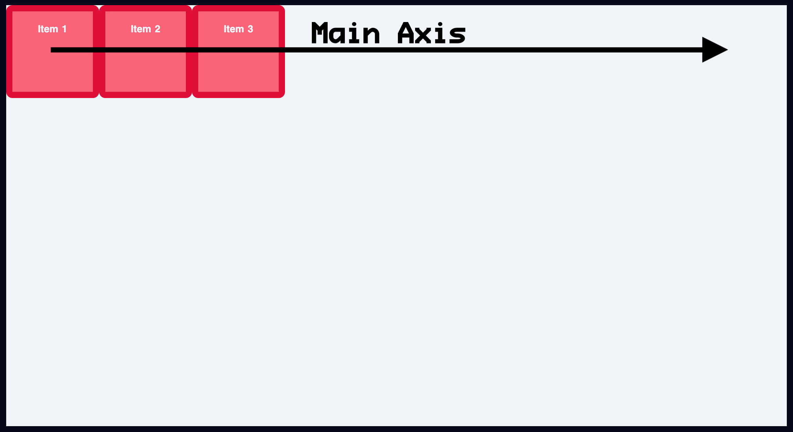
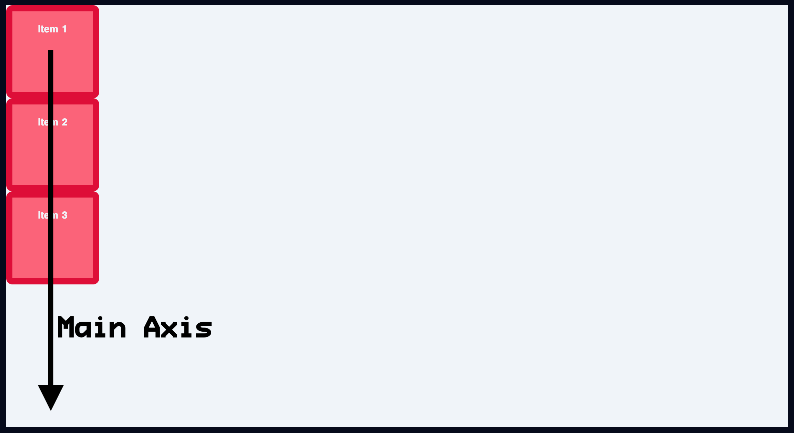
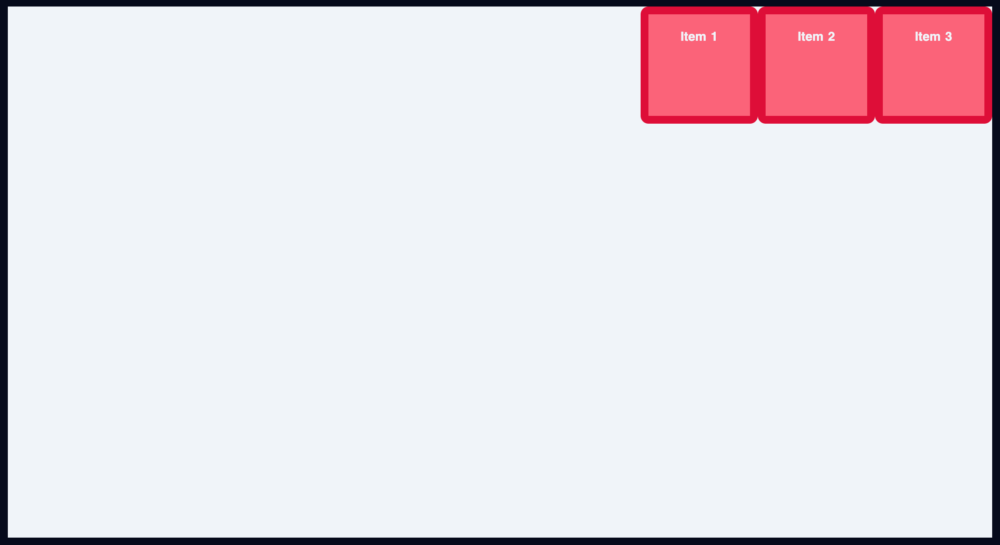

# [FLEXBOX](https://www.youtube.com/watch?v=phWxA89Dy94)

### Contents

1. [flex-direction](#flex-direction)
2. [justify-content](#justify-content)
3. [align-items](#align-items)


## flex-direction

- By default the flex direction is horizontal

```
  flex-direction: row;
```



 ```
  flex-direction: column;
 ```

 

## justify-content

- justify-content is used to align content on the main axis

1. flex-start
2. flex-end
3. center
4. space-between

- by default its set to

``` 
  flex-direction: row;
  justify-content: flex-start;
```


``` 
  flex-direction: row;
  justify-content: flex-end;
```



 ``` 
  flex-direction: row;
  justify-content: center;
```


``` 
  flex-direction: row;
  justify-content: space-between;
```


``` 
  flex-direction: row;
  justify-content: space-around;
```


``` 
  flex-direction: row;
  justify-content: space-evenly;
```


## align-items

- Aligning items on the cross axis