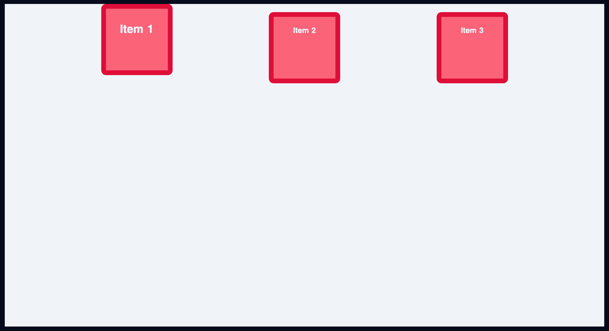

<h1 align="center"><a href="https://www.youtube.com/watch?v=phWxA89Dy94">FLEXBOX</a></h1>

### Contents

- These flexbox properties apply on the container and not the direct children

1. [flex-direction](#flex-direction)
2. [justify-content](#justify-content)
3. [align-items](#align-items)
4. [flex-wrap](#flex-wrap)
5. [gap](#gap)

- These flexbox properties apply on direct children of the container.

6. [flex-grow](#flex-grow) 
7. [flex-shrink](#flex-shrink) 
8. [flex-basis](#flex-basis) 
9. [shorthand notation](#shorthand-notation)

## flex-direction

- By default the flex direction is horizontal
```
.container {
  display: flex;
  flex-direction:row;
}
```


```
.container {
  display: flex;
  flex-direction: column;
}
```

 


## justify-content

- justify-content is used to align content on the main axis
- [flex-start](#flex-start)
- [flex-end](#flex-end)
- [center](#center)
- [space-between](#space-between)
- [space-around](#space-around)
- [space-evenly](#space-evenly)

---

### flex-start

``` 
.container {
  display: flex;
  flex-direction:row;
  justify-content: flex-start;
}
```


### flex-end

``` 
.container {
  display: flex;
  flex-direction:row;
  justify-content: flex-end;
}
```


### center

 ``` 
.container {
  display: flex;
  flex-direction:row;
  justify-content: center;
}
```


### space-between

``` 
.container {
  display: flex;
  flex-direction:row;
  justify-content: space-between;
}
```


### space-around

``` 
.container {
  display: flex;
  flex-direction:row;
  justify-content: space-around;
}
```


### space-evenly

``` 
.container {
  display: flex;
  flex-direction:row;
  justify-content: space-evenly;
}
```


## align-items

- Aligning items on the cross axis

- [flex-start](#flex-start)
- [flex-end](#flex-end)
- [center](#center)
- [basline](#basline)

### flex-start

``` 
.container {
  display: flex;
  flex-direction:row;
  justify-content: space-evenly;
  align-items: flex-start;
}
```


### flex-end

``` 
.container {
  display: flex;
  flex-direction:row;
  justify-content: space-evenly;
  align-items: flex-end;
}
```


### center

``` 
.container {
  display: flex;
  flex-direction:row;
  justify-content: space-evenly;
  align-items: center;
}
```


### baseline

- when font of item 1 increases the baselines of all the 3 items are same.

``` 
.container {
  display: flex;
  flex-direction:row;
  justify-content: space-evenly;
  align-items: baseline;
}

.item-1{
  font-size: 1.5rem;
}
```



## flex-wrap

- [nowrap](#flex-wrap)
- [wrap](#wrap)

### nowrap

- When the number of items increase inside a div they will squeeze and cram to fit inside the row


### wrap

- To solve this we can enable `flex-wrap` its set to `nowrap`.

```
.container {
  display: flex;
/* flex-direction:row; */
/* justify-content: space-evenly; */
/* align-items: baseline; */
  flex-wrap: wrap;
}
```


## align-content

- [flex-start](#flex-start)
- [flex-end](#flex-end)
- [center](#center)
- [basline](#basline)

- When `flex-wrap: wrap` is set and items are wrapping a new property is enabled that is `align-content`, 
- The possible properties are same as `justify-content`.

### flex-start

```
.container {
  display: flex;
/* flex-direction:row; */
/* justify-content: space-evenly; */
/* align-items: baseline; */
  flex-wrap: wrap;
  align-content: flex-start;
}
```


### flex-end

```
.container {
  display: flex;
/* flex-direction:row; */
/* justify-content: space-evenly; */
/* align-items: baseline; */
  flex-wrap: wrap;
  align-content: flex-end;
}
```


### center

```
.container {
  display: flex;
/* flex-direction:row; */
/* justify-content: space-evenly; */
/* align-items: baseline; */
  flex-wrap: wrap;
  align-content: center;
}
```


### center

```
.container {
  display: flex;
/* flex-direction:row; */
/* justify-content: space-evenly; */
/* align-items: baseline; */
  flex-wrap: wrap;
  align-content: center;
}
```


### space-around

```
.container {
  display: flex;
/* flex-direction:row; */
/* justify-content: space-evenly; */
/* align-items: baseline; */
  flex-wrap: wrap;
  align-content: space-around;
}
```


### space-between

```
.container {
  display: flex;
/* flex-direction:row; */
/* justify-content: space-evenly; */
/* align-items: baseline; */
  flex-wrap: wrap;
  align-content: space-between;
}
```


### space-evenly

```
.container {
  display: flex;
/* flex-direction:row; */
/* justify-content: space-evenly; */
/* align-items: baseline; */
  flex-wrap: wrap;
  align-content: space-evenly;
}
```


## gap

- The gap property is used to add gap between items.

```
.container {
  display: flex;
/* flex-direction:row; */
/* justify-content: space-evenly; */
/* align-items: baseline; */
  flex-wrap: wrap;
  align-content: flex-start;
  gap: 1em;
}
```


## flex-grow

- The parent div must be a flexbox for this to work
- flexgrow takes a unitless value and sets it as a propotion to the item

#### Example 1

```
.container {
  display: flex;
  /* flex-direction:row;*/
  /*justify-content:flex-start;*/
  /* align-items:center; */
  /*flex-wrap: wrap;*/
  /*align-content: flex-start;*/
  /*gap: 1em;*/
}

.item-3{
  flex-grow: 1;
}
```


#### Example 2

```
.container {
  display: flex;
  /* flex-direction:row;*/
  /* justify-content:space-between; */
  /* align-items:center; */
  /*flex-wrap: wrap;*/
  /*align-content: flex-start;*/
  /* gap: 1em;  */
}

.item-1{
  flex-grow: 1;
}

.item-2{
  flex-grow: 2;
}
.item-3{
  flex-grow: 3;
}
```


## flex-shrink

- `flex-shrink` also takes a unitless value
- It defines how fast one item shrink in comparison to the others
- If we set `flex-shrink: 0` it will refuse to shrink.

```
.container {
  display: flex;
  /* flex-direction:row;*/
  /* justify-content:space-between; */
  /* align-items:center; */
  /*flex-wrap: wrap;*/
  /*align-content: flex-start;*/
  /* gap: 1em;  */
}

.item-2{
  flex-grow: 1;
  flex-shrink: 5; /*This indicates that item 1 will shrink 5 times faster compared to other item when the screen is resized*/
}
```


## flex-basis

- `flex-basis` defines the size of an item before the remaining space is distributed.

```
.container {
  display: flex;
  /* flex-direction:row;*/
  /* justify-content:space-between; */
  /* align-items:center; */
  /*flex-wrap: wrap;*/
  /*align-content: flex-start;*/
  /* gap: 1em;  */
}

.item-1{
  /*flex-grow: 1; */
  /*flex-shrink: 5; */
  flex-basis: 300px;
}
```


- setting `flex-basis: 0 ` will shrink the item to the smallest possible size limit.


### Shorthand Notation

- syntax 
`flex: flex-grow flex-shrink flex-basis`

```
.container {
  display: flex;
  /* flex-direction:row;*/
  /* justify-content:space-between; */
  /* align-items:center; */
  /*flex-wrap: wrap;*/
  /*align-content: flex-start;*/
  /* gap: 1em;  */
}

.item-1{
  /*flex-grow: 1; */
  /*flex-shrink: 5; */
  /*flex-basis: 300px;*/
  flex: 1;  /*The other 2 values are selected intelligently for you*/
}
```